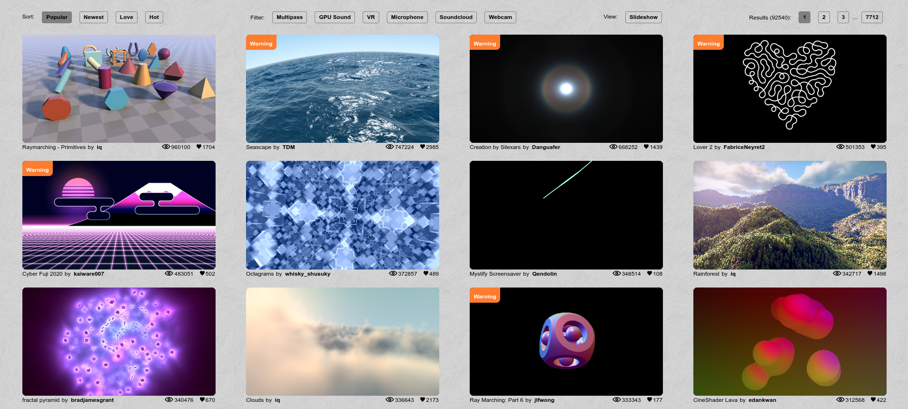

# Toonz Expansion Pack
It's all 3 separate words, the underscores were just for the repository name.
An expansion pack for OpenToonz or any derivative such as Tahoma2D. It contains guides, recipies, and even installable enhancements for OpenToonz and Tahoma2D. There already exists user documentation for both Tahoma2D and OpenToonz, this is my personal guide for myself or anyone reading how to extend it. You'll find below something I want to touch up on in some form, either be it documentation in the docs subdir or new content:

## MYPAINT Brushes
OpenToonz and Tahoma2D has 3 different types of brushes. Vector similar to flash, Raster which uses MyPaint as the engine, and smart raster which is more limited but like vector you can change some of it like the colours at will. MyPaint is a very good library that lets you make your own brushes. Graphite pencils, oil painting, or markers are such brushes using a simple json file called myb. So it's trivial to make your own brushes. OpenToonz and Tahoma2D comes with a number of packs already with a few other ones also available.

## GLSL Shaders
Toonz uses OpenGL shaders with the GPU to make a variety of effects. You can browse [shadertoy](https://www.shadertoy.com/) to see what it can really do. The txt docs in fact specifies shadertoy as one such area to get new shaders. GLSL is just a simple C like language that doesn't require a compiler like gcc or clang, it gets compiled by the GPU and is easy to distribute. Image example of some stuff from shadertoy:

I would argue you can do almost everything you desire with just OpenGL shaders. This leads me to the next part the low level COM like API.

## TOONZ PLUGIN API
OpenToonz and Tahoma2D built into the core have a low level COM like API for new nodes for fx. The SDK was meant to be resistant to change so you could update toonz without breaking your plugins. The low level parts are just 7 header files. A single wrapper is what you're supposed to use that does most of what you would have had to do anyways. Dwango and Wolf already ship out their own plugins and you could easy write your own. The downside with doing this instead of particles or OpenGL shaders is that you must compile and potentially link it against another library like OpenCV. Any file with .plugin is no different than a .dll on windows or a .so on GNU/Linux. But its the most powerful way to extend OpenToonz or Tahoma2D. You really don't need to make a plugin unless you really want to have full control over what the node can do beyond what toonz provides OR you want to implement a third party library into toonz. It's more work, but it can possibly pay off if you know what you're doing.

## PARTICLES
Particles are very tiny Fx nodes that let you do things like sparkles or snow or anything that's different in nature how toonz executes it from the GLSL OpenGL shaders. Another thing that makes it different is that it uses not a C like language that renders against the GPU but its an XML file that toonz takes advantage of.

## MACROS
After a while you're going to have a lot of nodes on the screen. You have two choices: Group them together or instead make a MacroFX. What the 2nd one is let you set a preset for convenience. Note that there is in general two different types of fx nodes as far as toonz cares: zerary which has its own level (The SDK utility doesn't cover this, you have to dig a bit deeper to use this effectively) or a regular fx node. You cannot use zerary effects with macros because its a limitation toonz decided to go with.

## THEMES
This is something interesting for those who want to do it. Toonz based programs like OpenToonz and Tahoma2D use Qt for the graphical user interface. Like with GTK, you can customize themes using CSS or as Qt5 calls them: qss. You'll be able to make your own themes should you desire to. Not the most important, but still something to note.

## ROOMS
What toonz calls rooms are a bunch of tabs with different importance. OpenToonz comes with a number of rooms for the xsheet (Something that dates back to the 30s with traditional animation) or the Fx interface, the animation itself, or whatever you desire. You can delete or make your own rooms in a plain text file in the correct location. This lets you enhance your workflow to fit your needs.

## OTHER
There is bound to be something I missed or forgot. This will be updated as I go along.

# Licensing
My stuff written new is under the zlib license, see a file named COPYING for the license. Everything else is under the license choice of the upstream user.
